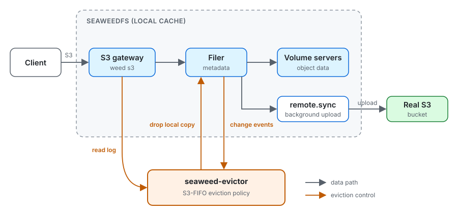

# seaweed-evictor

Keep a [SeaweedFS](https://github.com/seaweedfs/seaweedfs) cache in front of an
S3 bucket from growing past a size limit. It evicts with
[S3-FIFO](https://s3fifo.com/), so a one-off scan cannot flush the objects you
actually read.

It runs beside SeaweedFS and never handles your requests. It is an independent
project, not part of SeaweedFS.

## Quick start

```console
$ nix run .#dev
```

This starts a complete local setup: a fake "real S3" bucket, the cache in front
of it, background upload and the evictor. It prints the endpoint and
credentials. Point any S3 client at it.

| Setting | Effect |
| -------------------------------------- | ----------------------------------------------------- |
| `SEAWEED_EVICTOR_CAPACITY` | Cache size limit, e.g. `10GiB` (default 1 GiB) |
| `SEAWEED_EVICTOR_DATA` | Where state is kept (default `./.data`) |
| `SEAWEED_EVICTOR_ANONYMOUS_READ=1` | Let unsigned requests read the bucket, nothing else |
| `SEAWEED_EVICTOR_TLS=1` | Also serve HTTPS on port 38443 (self-signed) |
| `SEAWEED_EVICTOR_UI_PORT` | process-compose API port (default 18081) |

## Architecture



SeaweedFS keeps writes locally and uploads them to the bucket in the
background. The evictor watches the filer. Once the local data is bigger than
`--capacity`, it deletes the local chunks of the objects S3-FIFO ranks lowest,
the same thing `weed shell remote.uncache` does. The next read of such an object
fetches it from the bucket again.

Object sizes and upload state come from the filer's change events. Reads
produce no event, so the evictor also listens to the S3 gateway's audit log.
Without it, eviction is plain FIFO.

Objects that are not uploaded yet are never evicted. If the evictor lags, the
cache goes over the limit for a while.

## Run it against your own SeaweedFS

```console
$ seaweed-evictor --filer 127.0.0.1:18888 --capacity 10GiB
```

Every flag can also be set through an environment variable, and a flag wins
over the variable. Logs go to stdout.

| Flag | Environment variable | Default | Meaning |
| --- | --- | --- | --- |
| `--capacity` | `SEAWEED_EVICTOR_CAPACITY` | required | Cache size limit, e.g. `10GiB` or a byte count |
| `--filer` | `SEAWEED_EVICTOR_FILER` | `localhost:18888` | Filer **gRPC** address, which is the HTTP port plus 10000 |
| `--root` | `SEAWEED_EVICTOR_ROOT` | `/buckets` | Filer directory to manage |
| `--fluent-listen` | `SEAWEED_EVICTOR_FLUENT_LISTEN` | `127.0.0.1:24224` | Where to receive the read log. Pass an empty flag to disable it |
| `--log-level` | `SEAWEED_EVICTOR_LOG_LEVEL` | `info` | `debug`, `info`, `warn` or `error` |

SeaweedFS needs three things:

1. **Mount the bucket.** In `weed shell`:
   ```
   remote.configure -name=up -type=s3 -s3.access_key=... -s3.secret_key=... -s3.region=... -s3.endpoint=...
   remote.mount -dir=/buckets/cache -remote=up/your-bucket
   ```
1. **Upload in the background.**
   `weed filer.remote.sync -filer=<host:port> -dir=/buckets/cache`
1. **Send the read log to the evictor.** Start the S3 gateway with
   `-auditLogConfig=audit.json`, containing
   `{"fluent_host": "127.0.0.1", "fluent_port": 24224}`.

## NixOS

```nix
{
  inputs.seaweed-evictor.url = "github:Mic92/seaweed-evictor";

  # in your NixOS configuration:
  imports = [ inputs.seaweed-evictor.nixosModules.default ];

  services.seaweed-evictor = {
    enable = true;
    capacity = "500GiB";
    filer = "127.0.0.1:18888"; # gRPC port
  };
}
```

The options mirror the flags (`fluentListen = null` disables read tracking). The
module only runs the evictor, so set up SeaweedFS as described above. The
service restarts until the filer is reachable.

## Development

```console
$ nix develop        # Go, golangci-lint, seaweedfs
$ go test ./...      # integration tests start weed and skip without it
$ golangci-lint run
$ nix flake check    # tests, lint and formatting in the sandbox
$ nix fmt            # treefmt: nixfmt, deadnix, gofumpt, yamlfmt, mdformat
```

`s3fifo/` is a standalone size-weighted S3-FIFO with pinning. It has no
SeaweedFS dependency.

## License

MIT
